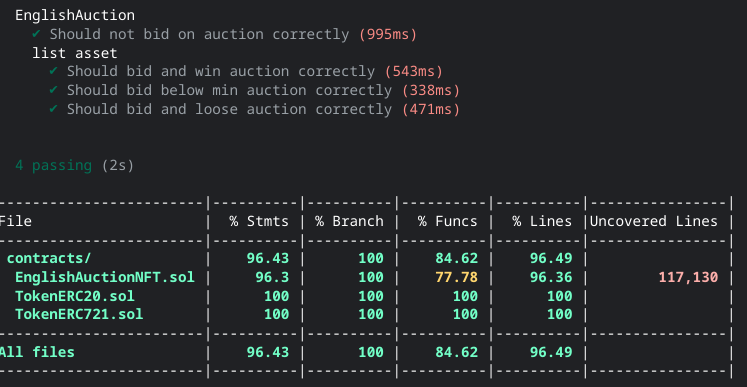

# NFT AUCTION

- A `hardhat` unit tested `English Auction` for`ERC-721` tokens with specified`ERC-20` currency tokens for each item.
- contracts that has been 100% covared with below features:

1. `onERC721Received` - ERC721TokenReceiver interface function. Hook that will be triggered on safeTransferFrom as per EIP-721. It executes a deposit for `_from` address. After deposit this token can be either returned back to the owner, or placed on auction. It emits an event that will let the user know that the deposit is successful. It calls ERC721 contract back to check if a token is received by auction (require ownerOf(nftId) to be equal address(this))

2. `listNFTOnAuction` - list on auction NFT that msg.sender has deposited with safeTransferFrom. Users willing to list their NFT are free to choose any ERC20 token for bids. Also, they have to input the auction start UTC timestamp, auction end UTC timestamp and minimum bid amount. During the auction there is no way for NFT to leave the contract - it is locked on contract. One NFT can participate in only one auction.

3. `placeBid` - takes from user ERC20 tokens specified in listOnAuction function for specific NFT (address+tokenId). Function reverts if bid is placed out of auction effective time range specified in listNFTOnAuction. Bid cannot be reverted, once tokens are deposited, they can be only returned when bidder loses.

4. `finishAuction` - can be called by anyone on blockchain after auction end UTC timestamp is reached. Function summarize auction results, transfer winning amount of ERC20 tokens to the auction issuer and unlock NFT for withdrawal or placing on auction again only for the auction winner. Note, that if the auction is finished without any single bid, it does not make any ERC20 token transfer and let the auction issuer withdraw the token or start auction again.

5. `withdrawNft` - transfers NFT to its owner. Owner of NFT is an address who has deposited an NFT and never placed it on auction, or deposited an NFT and placed on auction that didn’t receive any at least minimum bid, or auction winner that didn’t place his earned NFT on auction. During the auction NFT can’t be withdrawn.

- `ERC-721` Deployed and Verified on [goerli](https://goerli.etherscan.io/address/0xCbD4502031bfF6436bEa7769Efcd42F68b463c6f#code)
- `ERC-20` Deployed and Verified on [goerli](https://goerli.etherscan.io/address/0x57bD87B81514b681dCe682491d573f297a486d90#code)
- `EnglishAuction` Deployed and Verified on [goerli](https://goerli.etherscan.io/address/0x8445BBa6951Aa98ae86A0A05270c25d36b290320#code)

- with [owner](https://sepolia.etherscan.io/address/0x741e0608906B74B8754a99413A7374FdE7B9779a)

## hardhat tasks:

- `npm install hardhat`
- `npx hardhat coverage`
- `npx hardhat run --network goerli scripts/deployERC721.ts`
- `npx hardhat run --network goerli scripts/deployERC20.ts`
- `npx hardhat run --network goerli scripts/deployEnglishAuction.ts`

## coverage

 

</a>

 
